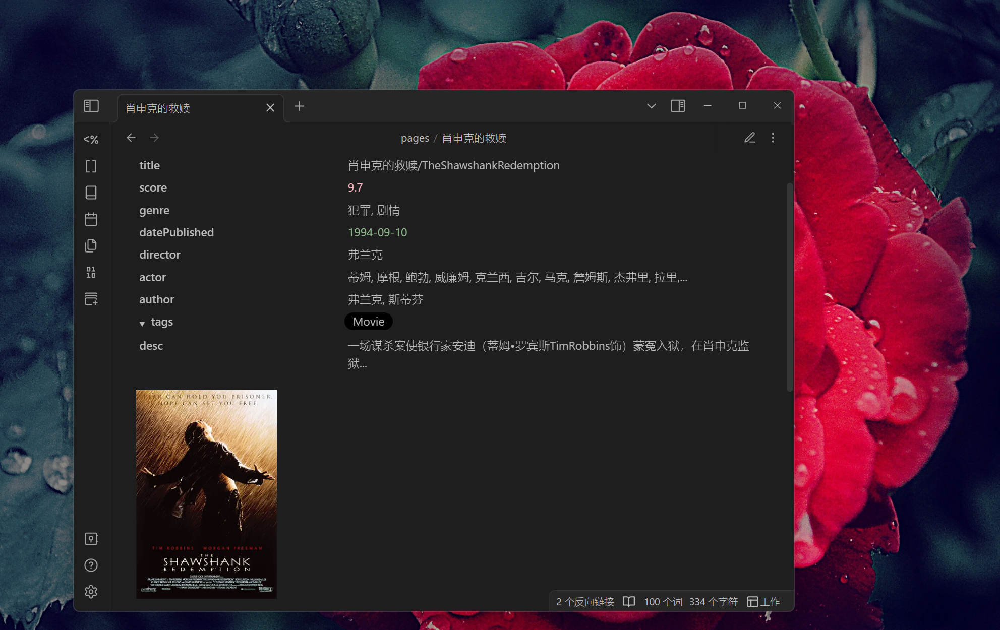
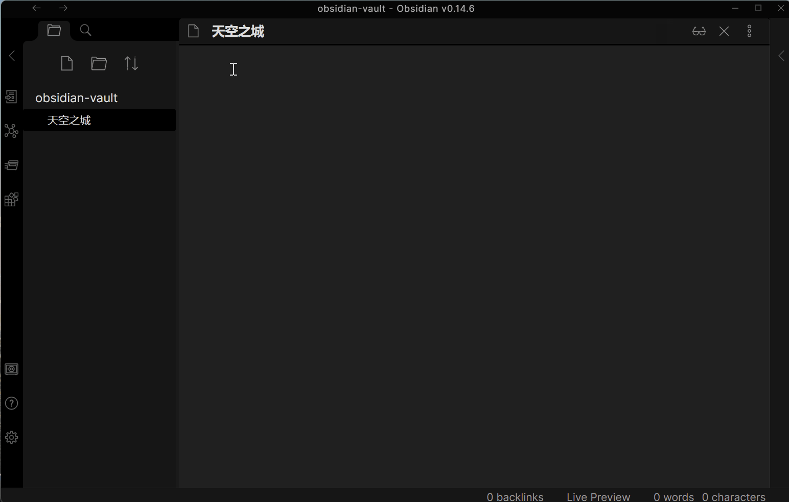
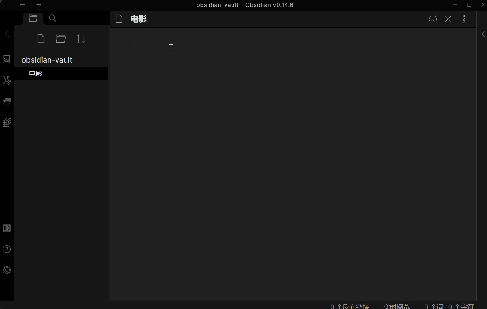
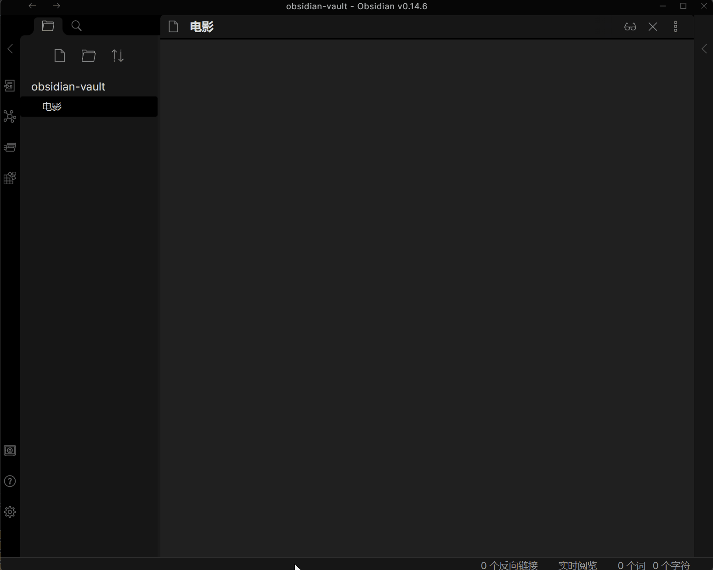

# Obsidian Douban Plugin

    
    
	
	
	
	 
	
	

Import Movie, Book, Music, Teleplay, Note, Game even Broadcast Data from Douban in [Obsidian](https://obsidian.md/)   
在[Obsidian](https://obsidian.md/)使用并导入豆瓣中的电影/书籍/音乐/电视剧/日记/游戏甚至是广播, 包含评分/发布日期/演员表等信息

---
If you want some features or have any questions about this plugin, create issues or join the development is welcome.  
关于当前的插件如果有任何疑问, 缺少想要的导入内容或者想要什么功能, 欢迎提issues或加入到开发当中.

- [Bugs, Issues, & Feature Requests](https://github.com/Wanxp/obsidian-douban/issues)
- [Development Roadmap](https://github.com/users/Wanxp/projects/1)

## Support Field/支持的字段
	(若有字段缺失, 欢迎提issues反馈)

---
| 字段          | 电影                 | 电视剧               | 书籍                 | 音乐               | 日记     | 游戏             | 广播 |
| ------------- | -------------------- | -------------------- | -------------------- | ------------------ | -------- | ---------------- | ---- |
| id            | 豆瓣ID               | 豆瓣ID               | 豆瓣ID               | 豆瓣ID             | 豆瓣ID   | 豆瓣ID           | -    |
| title         | 电影名称             | 电视剧名称           | 书名                 | 音乐名             | 日记标题 | 游戏名称         | -    |
| type          | 类型                 | 类型                 | 类型                 | 类型               | 类型     | 类型             | -    |
| score         | 评分                 | 评分                 | 评分                 | 评分               | 评分     | 评分             | -    |
| image         | 封面                 | 封面                 | 封面                 | 封面               | 图片     | 封面             | -    |
| url           | 豆瓣网址             | 豆瓣网址             | 豆瓣网址             | 豆瓣网址           | 豆瓣网址 | 豆瓣网址         | -    |
| desc          | 简介                 | 简介                 | 内容简介             | 简介               | 简介     | 简介             | -    |
| publisher     | -                    | -                    | 出版社               | 出版者             | 发布者   | 发行商           | -    |
| datePublished | 上映日期             | 上映日期             | 出版年               | 发行时间           | 发布时间 | 发行日期         | -    |
| genre         | 类型                 | 类型                 | -                    | 流派               | -        | 类型             | -    |
| 扩展1         | director:导演        | director:导演        | author:原作者        | actor: 表演者      | author:作者         | aliases:别名     |      |
| 扩展2         | author:编剧          | author:编剧          | translator:译者      | albumType:专辑类型 | authorUrl:作者网址         | developer:开发商 |      |
| 扩展3         | actor:主演           | actor:主演           | isbn:isbn            | medium:介质        | content:日记内容         | platform:平台    |      |
| 扩展4         | originalTitle:原作名 | originalTitle:原作名 | originalTitle:原作名 | records:唱片数     |          |                  |      |
| 扩展5         |                      |                      | subTitle:副标题      | barcode:条形码     |          |                  |      |
| 扩展6         |                      |                      | totalPage:页数       |                    |          |                  |      |
| 扩展7         |                      |                      | series:丛书          |                    |          |                  |      |
| 扩展8         |                      |                      | menu:目录            |                    |          |                  |      |
| 扩展9         |                      |                      | price:定价           |                    |          |                  |      |
| 扩展7         |                      |                      | binding:装帧         |                    |          |                  |      |

## How to use
### Search
- Search Data By File Name
  通过当前文件名搜索
  

- Search Movie By Input Text   
  通过输入文本搜索
  

## Settings
- Setting Example1(Custom Template)  
  设置案例1(自定义模板)
  

- Setting Example2(Other Settings)  
  设置案例2(其它配置)
  

## Target
- [x] Movie/电影
- [x] Teleplay/电视剧
- [x] Book/书籍
- [x] Music/音乐
- [x] Note/日记
- [x] Game/游戏
- [ ] Broadcast/广播

## How to install
### From Obsidian
1. Go to Obsidian plugin center
2. Search obsidian-douban
3. Click install
4. Enable plugin
---
### 从Obsidian插件中心
1. 进入Obsidian插件中心
2. 搜索obsidian-douban
3. 安装
4. 开启插件

### Manmel
1. Download `main.js`, `manifest.json`, `styles.css` from GitHub release page
2. Copy step1 downloaded file to your vault folder `/.obsidian/plugins/obsidian-douban/`
3. Enable plugin in Obsidian
----
### 手动安装
1. 从Github release 页面下载 `main.js`, `manifest.json`, `styles.css`
2. 将下载的文件复制到你的Obsidian文档根目录下的`/.obsidian/plugins/obsidian-douban`路径,若不存在则新建文件夹(注意.obsidian文件夹可能是个隐藏为文件夹)
3. 在obsidian插件中心开启当前插件功能

## How to Develop
1. Enter your test vault folder `/.obsidian/plugins/`
2. Clone Code
   `git clone git@github.com:Wanxp/obsidian-douban.git`
3. Enter folder
   `cd obsidian-douban`
4. Build
   `npm run build`
5. Run and Watch code chang
   `npm run dev`
6. Go to your Obsidian plugin center reload this plugin
7. Enjoy your develop
---
1. 进入你的Obsidian测试文档文件夹下的`/.obsidian/plugins/`
2. 克隆代码  
   `git clone git@github.com:Wanxp/obsidian-douban.git`
3. 进入代码文件夹  
   `cd obsidian-douban`
4. 构建  
   `npm run build`
5. 运行  
   `npm run dev`
6. 进入Obsidian插件中心重新加载当前插件
7. 享受开发吧  
