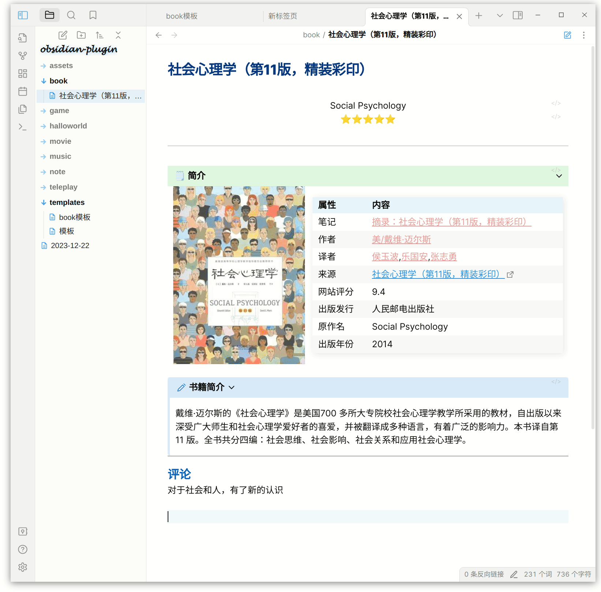
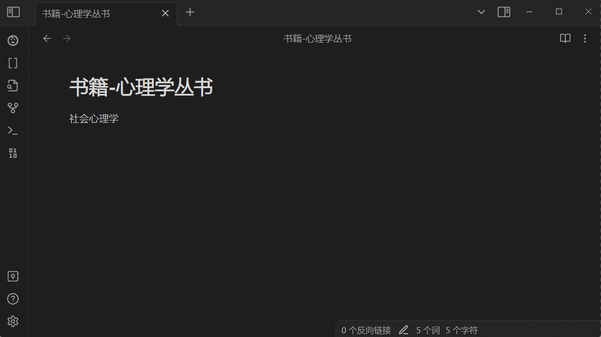
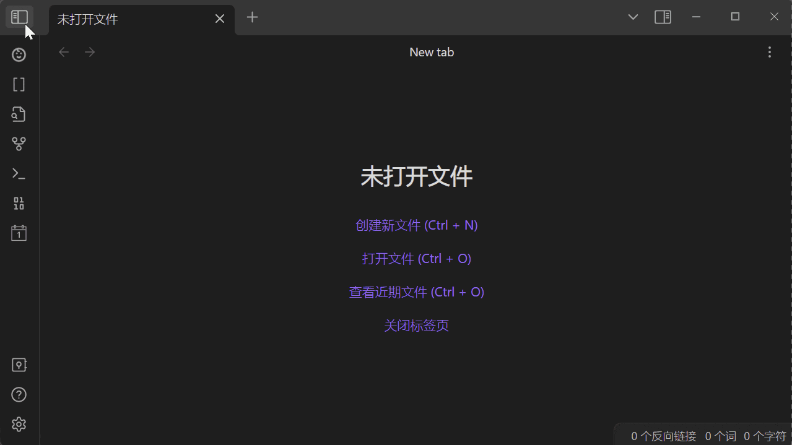
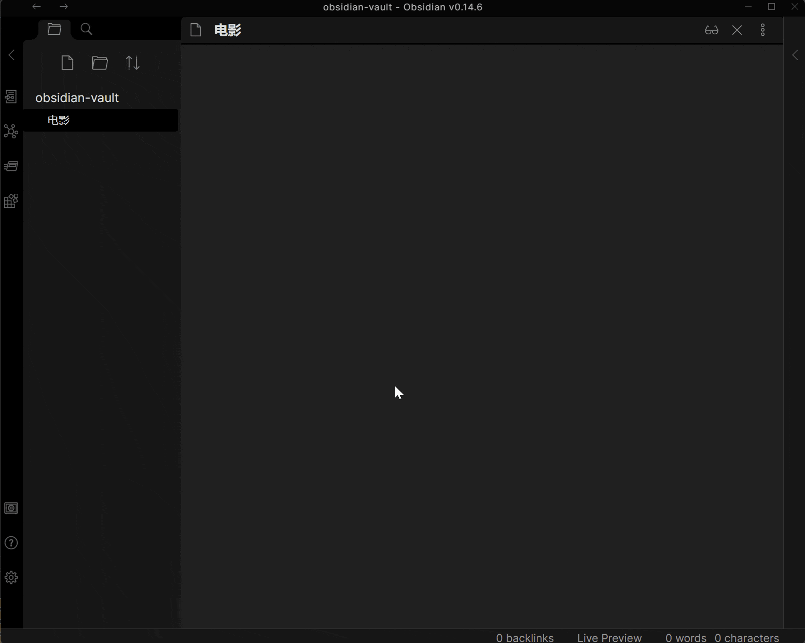

# Obsidian Douban Plugin

    
        
        
       
       
       
        
       
       

    

在[Obsidian](https://obsidian.md/)使用并导入豆瓣中的 _电影/书籍/音乐/电视剧/日记/游戏_ 甚至是 _你标记过的书影音_ , 包含你的评分/发布日期/演员表等信息.   

---  
关于当前的插件如果有任何疑问, 缺少想要的导入内容或者想要什么功能, 欢迎提issues或加入到开发当中.  
如果觉得喜欢或对您有帮助，欢迎一键三连-点亮 ⭐Star

- [异常, 问题 & 新的想法](https://github.com/Wanxp/obsidian-douban/issues)
- 阅读其它语言的介绍请点击 [English](./doc/README.en.md) | [简体中文](./README.md)

## 功能
- [x] 同步个人看过的电影
- [x] 同步个人阅读过的书籍
- [x] 同步个人听过的音乐
- [x] 导入电影
- [x] 导入电视剧
- [x] 导入书籍
- [x] 导入音乐
- [x] 导入日记
- [x] 导入游戏
- [x] 导入个人的评论,评论时间,阅读状态,个人评分
- [x] 支持保存封面至本地
- [x] 支持自定义参数
- [ ] 广播

## 如何使用
### 同步
- 同步个人的观影、阅读、游戏、音乐记录    
  从豆瓣同步数据(如何利用Timeline插件构建阅读/观影时间线，请参照[结合timeline插件实现时间线效果](./doc/Obsidian-Douban-TimeLine.md))    
  
### 搜索
- 搜索数据并创建笔记  
  
- 通过当前文件名搜索    
  

- 通过输入文本搜索    
  

## 设置
- 设置案例1(自定义模板)    
  

- 设置案例2(其它配置)    
  

## 支持的字段
(若有缺少想导入的字段, 欢迎提issues反馈)

| 字段               | 电影                | 电视剧              | 书籍                | 音乐             | 日记             | 游戏            | 广播 |
|------------------|-------------------|------------------|-------------------|----------------|----------------|---------------| ---- |
| id               | 豆瓣ID              | 豆瓣ID             | 豆瓣ID              | 豆瓣ID           | 豆瓣ID           | 豆瓣ID          | -    | 
| title            | 电影名称              | 电视剧名称            | 书名                | 音乐名            | 日记标题           | 游戏名称          | -    |   
| type             | 类型                | 类型               | 类型                | 类型             | 类型             | 类型            | -    |   
| score            | 评分                | 评分               | 评分                | 评分             | 评分             | 评分            | -    |   
| image            | 封面                | 封面               | 封面                | 封面             | 图片             | 封面            | -    |    
| url              | 豆瓣网址              | 豆瓣网址             | 豆瓣网址              | 豆瓣网址           | 豆瓣网址           | 豆瓣网址          | -    |    
| desc             | 简介                | 简介               | 内容简介              | 简介             | 简介             | 简介            | -    |    
| publisher        | -                 | -                | 出版社               | 出版者            | 发布者            | 发行商           | -    |    
| datePublished    | 上映日期              | 上映日期             | 出版年               | 发行时间           | 发布时间           | 发行日期          | -    |    
| yearPublished    | 上映年份              | 上映年份             | 出版年份              | 发行年份           | 发布年份           | 发行年份          | -    |    
| genre            | 类型                | 类型               | -                 | 流派             | -              | 类型            | -    |   
| currentDate      | 今日日期              | 今日日期             | 今日日期              | 今日日期           | 今日日期           | 今日日期          |      |  
| currentTime      | 当前时间              | 当前时间             | 当前时间              | 当前时间           | 当前时间           | 当前时间          |      |   
| myTags           | 我标记的标签            | 我标记的标签           | 我标记的标签            | 我标记的标签         | -              | 我标记的标签        |      |  
| myRating         | 我的评分              | 我的评分             | 我的评分              | 我的评分           | -              | 我的评分          |
| myState          | 状态:想看/在看/看过       | 状态:想看/在看/看过      | 状态:想看/在看/看过       | 状态:想听/在听/听过    | -              | 状态:想玩/在玩/玩过   |      |    
| myComment        | 我的评语              | 我的评语             | 我的评语              | 我的评语           | -              | 我的评语          |      |  
| myCollectionDate | 我标记的时间            | 我标记的时间           | 我标记的时间            | 我标记的时间         | -              | 我标记的时间        |      |   
| 扩展1              | director:导演       | director:导演      | author:原作者        | actor: 表演者     | author:作者      | aliases:别名    |      |   
| 扩展2              | author:编剧         | author:编剧        | translator:译者     | albumType:专辑类型 | authorUrl:作者网址 | developer:开发商 |      |    
| 扩展3              | actor:主演          | actor:主演         | isbn:isbn         | medium:介质      | content:日记内容   | platform:平台   |      |    
| 扩展4              | originalTitle:原作名 | originalTitle:原作名 | originalTitle:原作名 | records:唱片数    |                |               |      |   
| 扩展5              | country:国家        | country:国家       | subTitle:副标题      | barcode:条形码    |                |               |      |   
| 扩展6              | language:语言       | language:语言      | totalPage:页数      |                |                |               |      |    
| 扩展7              | time:片长           | time:片长          | series:丛书         |                |                |               |      |    
| 扩展8              | aliases:又名        | aliases:又名       | menu:目录           |                |                |               |      |    
| 扩展9              | IMDb              | IMDb             | price:定价          |                |                |               |      |     
| 扩展7              |                   | episode:集数       | binding:装帧        |                |                |               |      |    
| 扩展8              |                   |                  | producer: 出品方     |                |                |               |      |     

- 注: myTags, myRating, myState, myComment, myCollectionDate 参数均为在插件中登录后可用

## 如何安装
### 从Obsidian插件中心
1. 进入Obsidian插件中心
2. 搜索obsidian-douban
3. 安装
4. 开启插件

### 手动安装

1. 从[Github release](https://github.com/Wanxp/obsidian-douban/releases) 页面下载 `main.js`, `manifest.json`, `styles.css`
2. 将下载的文件复制到你的Obsidian文档根目录下的`/.obsidian/plugins/obsidian-douban`路径,若不存在则新建文件夹(注意.obsidian文件夹可能是个隐藏为文件夹)
3. 在obsidian插件中心开启当前插件功能

## 如何开发调试

1. 进入你的Obsidian测试文档文件夹下的`/.obsidian/plugins/`
2. 克隆代码      
   `git clone git@github.com:Wanxp/obsidian-douban.git`
3. 进入代码文件夹      
   `cd obsidian-douban`
4. install
	`npm install`
5. 构建      
   `npm run build`
6. 运行      
   `npm run dev`
7. 进入Obsidian插件中心重新加载当前插件
8. 享受开发吧

## 交流社群
      

## 免责声明
1. 建议使用本插件前，一定要至少有一种方式备份你的数据，以防万一。
2. 本程序没有爬取任何书影音等内容，只供技术研究使用。没有侵犯书影音作者版权和豆瓣官方利益。如有任何侵权行为，请联系我删除。
3. 本程序仅供学习交流使用。
4. 虽然极力避免，但还是有可能纰漏，所以因使用插件造成的损失，由使用者本人承担。不同操作会有何种影响，请参照<a href="#impact">影响</a>
5. 使用或修改本插件，即视为同意上述免责声明。
## 影响
注意: 除了在同步书影音数据时勾选 `替换同名文档` 有可能会修改同路径同文档名的笔记外，其余操作均不会修改已有笔记。

| 操作      | 条件               | 影响                        | 举例                                                                                            |
|---------|------------------|---------------------------|-----------------------------------------------------------------------------------------------|
| 导入书影音数据 | 默认条件             | 新建一条名为所选条目的笔记             | 如搜索蝙蝠侠并选中导入，则会创建笔记 《蝙蝠侠》                                                                      |
| 导入书影音数据 | 已有同名笔记           | 无任何影响，提示已经存在同名笔记，不会修改已有笔记 | 如搜索蝙蝠侠并选中导入，但因存在同路径同名称笔记，则会不会创建笔记                                                             |
| 导入书影音数据 | 配置 `笔记名称`值包含路径   | 若没有此路径则会创建对应文件名           | 如搜索蝙蝠侠并选中导入，配置`笔记名称`值为`/data/{{type}}/{{title}}`，则会创建文件夹`data/电影`                             |
| 导入书影音数据 | 配置 `保存图片附件`值为勾选 | 则会在`附件存放位置`指定位置保存封面图片     | 如搜索蝙蝠侠并选中导入，配置`附件存放位置`值为`assets`，则会在`assets`文件夹中保存封面文件`p462657443.jpg`                        |
| 同步书影音数据 | 以上所有             | 以上所有                      | 以上所有                                                                                          |
| 同步书影音数据 | `替换同名文档`值为勾选     | 已经存在 **同路径同文档名** ，直接覆盖    | 如已经存在在`data/Movie/蝙蝠侠.md`,配置`笔记名称`值为`/data/{{type}}/{{title}}`, 同步书影音记录时勾选 `替换同名文档`, 则`data/Movie/蝙蝠侠.md`会被替换成最新 |

## 鸣谢
### IDE支持
[<image src="doc/img/jb_beam.svg"> </image>](https://www.jetbrains.com/?from=obsidian-douban)
