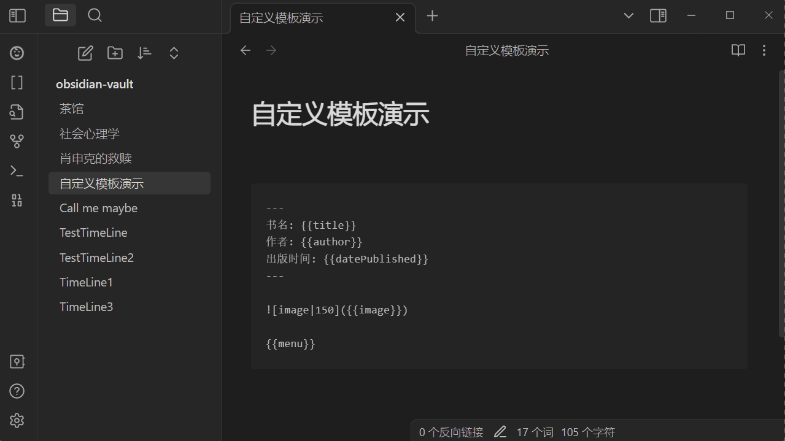

# Obsidian Douban Plugin

Import Movies, Books, Music Data from Douban in [Obsidian](https://obsidian.md/)

在[Obsidian](https://obsidian.md/)使用并导入豆瓣中的电影/音乐/以及书籍等, 评分/发布日期/演员表等信息

If you want some features or have any questions about this plugin, create issues or join the development is welcome.
关于当前的插件如果有任何疑问或者想要什么功能, 欢迎提issues或加入到开发当中.

- [Bugs, Issues, & Feature Requests](https://github.com/Wanxp/obsidian-douban/issues)
- [Development Roadmap](https://github.com/users/Wanxp/projects/1)

## Target
- [x] Movie/电影
- [ ] Book/书籍
- [ ] Music/音乐
- [ ] Broadcast/广播

## How to use
### Movie
- Search Movie By Input Text/通过输入文本搜索

- Search Movie By File Name/通过文件名搜索

## Settings
- Setting Example2/设置案例2

- Setting Example1/设置案例1

## How to install 
### From Obsidian 
1. go to obsidian plugin center
2. search obsidian-douban
3. click install
4. enable plugin
### Manmel
#### Windows
#### 

### Linx