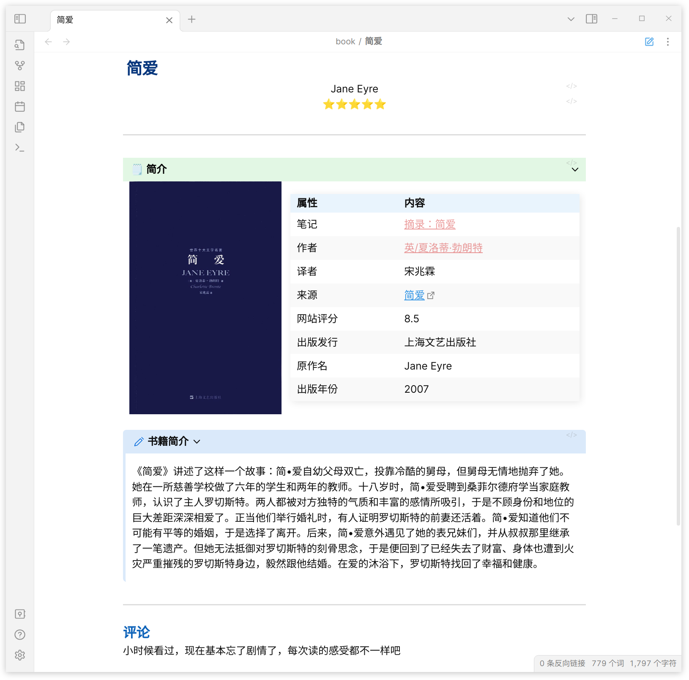

这是一款[Obsidian](https://obsidian.md/)的插件, 用于导入[豆瓣](https://www.douban.com/)中的 _电影、书籍、音乐、电视剧、日记、游戏_
甚至是 _你标记过的书影音_ , 包含你的评分、观看日期、评论、阅读状态等信息.   

## 基本功能
- ☑️ 导入电影、电视剧、书籍、音乐、游戏、日记
- ☑️ 同步个人听过/看过的电影、电视剧、书籍、音乐
- ☑️ 导入个人的评论,评论时间,阅读状态,个人评分
- ☑️ 支持保存封面至本地
- ☑️ 支持自定义参数
  
## 交流社群
 

    
        
        
       
       
       
        
       
       

    

[Just the Docs repo]: https://github.com/Wanxp/obsidian-douban
