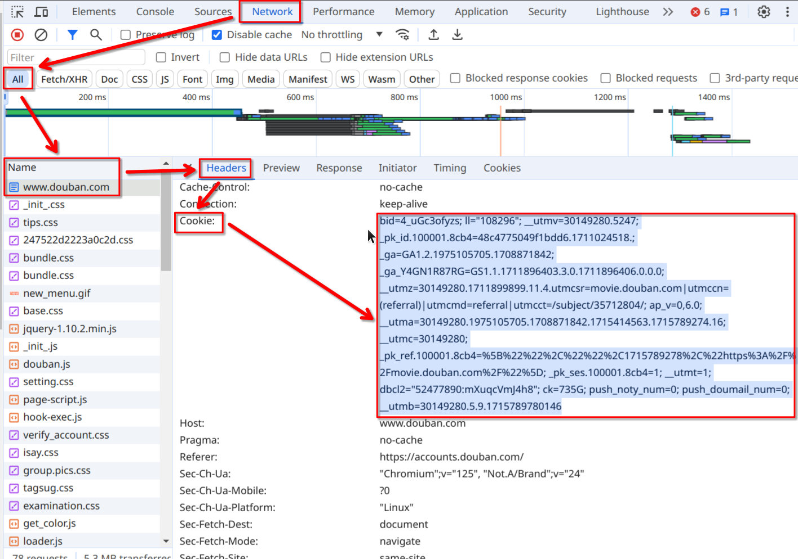

# 登录方式
Obsidian-Douban插件提供了两种登录方式，扫码登录和Cookie登录。扫码登录是推荐的方式，但如果扫码登录失败，可以使用Cookie登录。
## 扫码登录
扫码登录是Obsidian-Douban插件的默认登录方式，适用于大多数用户。扫码登录的步骤如下：
1. 在Obsidian-Douban插件设置中点击`登录按钮`
2. 弹出扫码登录窗口
3. 使用手机或其他设备的豆瓣APP 扫描二维码
4. 在手机上确认登录
5. 登录成功后，Obsidian-Douban插件会自动获取您的豆瓣账号信息
## Cookie登录Douban
此方式仅在Obsidian-Douban中点击`登录按钮`，弹窗后，扫码登录失败的用户
### 操作
1. 打开浏览器(此处默认为您使用的浏览器为Chrome或Chromium衍生浏览器)
2. 访问[豆瓣网站](https://www.douban.com/)
3. 在豆瓣网站中 登录豆瓣
4. 再次访问`https://douban.com`
5. 打开浏览器开发者工具(按键 ctrl + shift +i 或者 F12 或者 右键选择 检查)
6. 选择开发者工具中的`网络`(Network)页签
7. 在出现的页签中选择`全部`(All)
8. 在出现的列表中网上翻找到最上面一条`www.douban.com`, 并点击
9. 点击后出现的`请求头`(Headers) 栏目，找到`请求头`(Request Headers)
10. 找到请求头中的Cookie，选中并复制右边的值  

11. 然后回到Obsidian-Douban插件设置中，点击Cookie登录
12. 将浏览器中复制的Cookie值粘贴到弹窗中的输入框中
13. 点击确认

