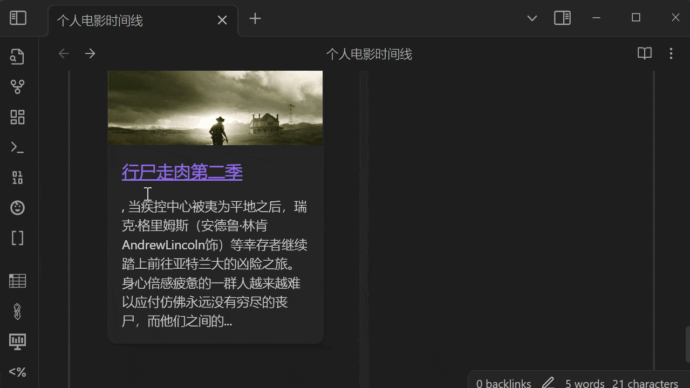

## 效果
1. 结合Timeline插件 __构建个人观影时间线__，请参照[结合timeline插件实现时间线效果](./Obsidian-Douban-TimeLine.md)
   
<!--2.  结合DataView插件，__构建个人电子书架（书库数据）__，请参照[结合dateview插件实现个人书架效果](./doc/Obsidian-Douban-DataView.md))-->
2. 结合主题 __构建类豆瓣网页效果__，请参照[结合Blue Topaz实现网页效果](./Obsidian-Douban-BlueTopaz.md)
   
