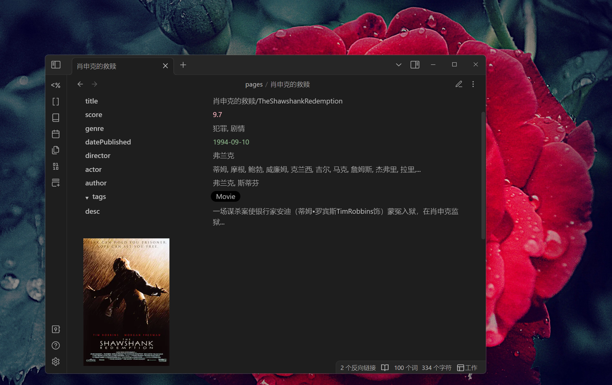

## 效果如下


## 适用人群
1. 在豆瓣有标记/评论/评分的习惯的人   
比如看完电影，会在豆瓣进行评分或评论。或者阅读完的书籍，进行评分或评论。支持包含：电影、书籍、电视剧、音乐、游戏

## 实现步骤
1. 安装[Blue Topaz](https://github.com/PKM-er/Blue-Topaz_Obsidian-css)插件， 可在Obsidian主题搜索中找到 `Blue Topaz`
2. 安装[Obsidian-Douban](https://github.com/Wanxp/obsidian-douban)插件(本插件)
3. 在Obsidian-Douban插件配置中登录Douban
4. 配置需要的模板文件, 在模板中 ==增加== 以下内容，如下所示


````markdown
---

#  {{title}}
<div style="text-align: center;">{{originalTitle}}</div>  
<div style="text-align: center;">{{scoreStar}}</div>

---

> [!bookinfo|noicon]+ 🗒️ **简介**
> 
>
| 属性     | 内容                     |
|:-------- |:------------------------ |
| 笔记     | [[摘录：{{title}}]]      |
| 作者     | {{author(ArrayType1)}}             |
| 译者     | {{translator(ArrayType1)}}     |
| 来源     | [ {{title}} ]( {{url}} ) |
| 网站评分     | {{score}}                |
| 出版发行 | {{publisher}}        |
| 原作名   | {{originalTitle}}        |
|     出版年份    |  {{yearPublished}}                        |

> [!note]- 书籍简介\
> {{desc}}

---
### 评论

{{myComment}}
````


5. 设置模板为上面的模板
6. 增加数组输出形式
进入插件设置界面，找到[数组输出]

## 模板参考
### 书籍

````markdown
---
doubanId: {{id}}
title: {{title}}
subTitle: {{subTitle}}
originalTitle: {{originalTitle}}
series: {{series}}
type: {{type}}
author: {{author}}
score: {{score}}
scoreStar: {{scoreStar}}
myRating: {{myRating}}
datePublished: {{datePublished}}
translator: {{translator}}
publisher: {{publisher}}
producer: {{producer}}
isbn: {{isbn}}
url: {{url}}
totalPage: {{totalPage}}
price: {{price}}
tags: {{tags}}
state: {{myState}}
binding: {{binding}}
createTime: {{currentDate}} {{currentTime}}
collectionDate: {{myCollectionDate}}
desc: {{desc}}
---

#  {{title}}
<div style="text-align: center;">{{originalTitle}}</div>  
<div style="text-align: center;">{{scoreStar}}</div>

---

> [!bookinfo|noicon]+ 🗒️ **简介**
> 
>
| 属性     | 内容                     |
|:-------- |:------------------------ |
| 笔记     | [[摘录：{{title}}]]      |
| 作者     | {{author(ArrayType1)}}             |
| 译者     | {{translator(ArrayType1)}}     |
| 来源     | [ {{title}} ]( {{url}} ) |
| 网站评分     | {{score}}                |
| 出版发行 | {{publisher}}        |
| 原作名   | {{originalTitle}}        |
|     出版年份    |  {{yearPublished}}                        |

> [!note]- 书籍简介\
> {{desc}}

---
### 评论

{{myComment}}

### 目录

{{menu}}
````

## 电影、电视剧、音乐、游戏
请参照书籍模板

## 更多
此效果来自热心用户的分享，感谢
