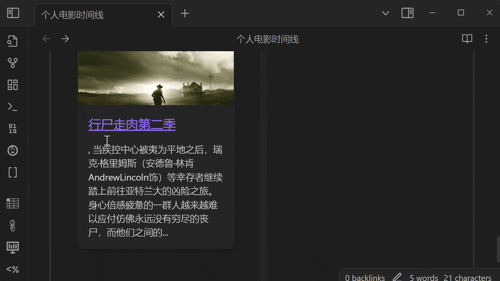

## 效果如下


## 适用人群
1. 在豆瓣有标记/评论/评分的习惯的人   
比如看完电影，会在豆瓣进行评分或评论。或者阅读完的书籍，进行评分或评论。支持包含：电影、书籍、电视剧、音乐、游戏

## 实现步骤
1. 安装[Timelines](https://github.com/Darakah/obsidian-timelines)插件
2. 安装[Obsidian-Douban](https://github.com/Wanxp/obsidian-douban)插件(本插件)
3. 在Obsidian-Douban插件配置中登录Douban
4. 配置同步需要的模板 电影/书籍的模板中的frontmatter，在frontmatter中 **增加** 特定tags（根据自己的需要指定），用于需要过滤成为timeline的笔记，如增加tags：`我看过的电影`


````markdown
---
tags: 我看过的电影
---
````
5. 同时，在电影/书籍... 模板中的 **最后增加** timeline插件需要的html标签如下:

```html
<span class='ob-timelines' data-date='{{myCollectionDate}}' 
data-title='{{title}}' data-img='{{image}}'
 data-class = "custom-my-movie-time-line">{{myComment}} |简介: {{desc}}
 </span> 
```
6. 选择上述模板导入 电影/书籍...，操作方式是打开obsidian命令窗口，输入豆瓣，找到导入功能，在导入界面配置 选择模板进行导入
7. 导入需要一定时间，每条内容导入需要15-30s左右，所有有导入完成后会有导入汇总
8. 导入完成后，新建一个笔记，笔记内容加入timeline的代码块，代码块的内容就是你上面指定的tags的内容，如`我看过的电影`，代码块如下：

````markdown
```timeline
我看过的电影
```
````


9. 预览这个笔记就能看出已经出现了时间线

## 模板参考
### 电影


````markdown
---
doubanId: {{id}}
title: {{title}}
type: {{type}}
score: {{score}}
myRate: {{myRate}}
originalTitle: {{originalTitle}}
genre: {{genre}}
datePublished: {{datePublished}}
director: {{director}}
actor: {{actor}}
author: {{author}}
tags: {{type}}, 我看过的电影, {{myTags}}
state: {{myState}}
url: {{url}}
coverUrl: {{imageData.url}}
createTime: {{currentDate}} {{currentTime}}
collectionDate: {{myCollectionDate}}
desc: {{desc}}
---


Comment: 
---
{{myComment}}


<span class='ob-timelines' data-date='{{myCollectionDate}}'
data-title='{{title}}' data-img='{{image}}'
data-class = "custom-my-movie-time-line">{{myComment}} |简介: {{desc}}
</span> 
````


## 书籍、电视剧、音乐、游戏
请参照电影模板

## 更多
此效果来自热心用户的分享，感谢[](https://github.com/eryajf)  
参照讨论 [结合timeline插件的妙用](https://github.com/Wanxp/obsidian-douban/issues/19#issuecomment-1428307130)
