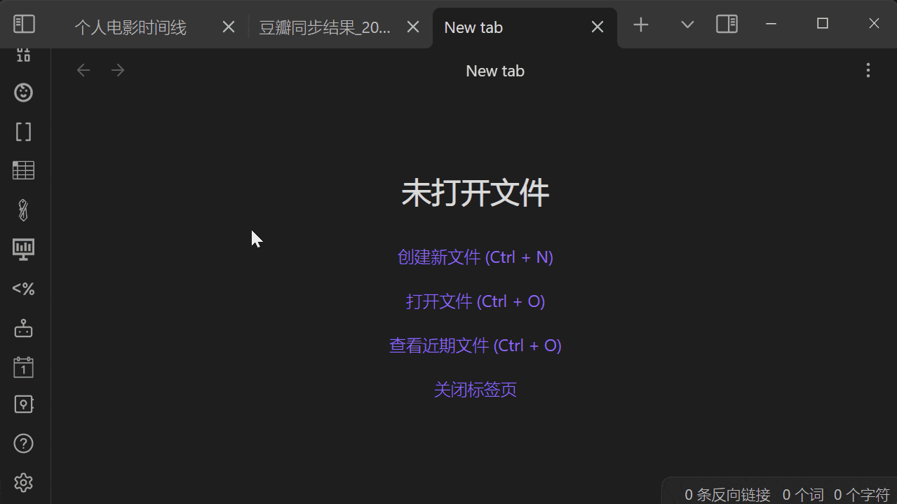

# Obsidian Douban Plugin

    
        
        
       
       
       
        
       
       

    

Import _Movie, Book, Music, Teleplay, Note, Game_ even _Your Personal Movie/Book/Music_ from Douban in [Obsidian](https://obsidian.md/)         

---  
If you want some features or have any questions about this plugin, create issues or join the development is welcome or ⭐Star

- [Bugs, Issues, & Feature Requests](https://github.com/Wanxp/obsidian-douban/issues)
- Read Other Languages: [English](./README.en.md) | [简体中文](../README.md)

## Target/功能
- [x] Sync Personal Movie
- [x] Sync Personal Book
- [x] Sync Personal Music
- [x] Import Movie
- [x] Import Teleplay
- [x] Import Book
- [x] Import Music
- [x] Import Note
- [x] Import Game
- [x] Personal Comment
- [x] Attachment Files
- [x] Custom Variables
- [ ] Broadcast

## How to use
### Sync
- Sync Data From Douban    
  Sync data from Douban (to learn how to use the TimeLine plugin to build a reading/movie watching timeline, please refer to [here](Obsidian-Douban-TimeLine.en.md)).
  
### Search
- Search Data And Create Note  
  ![search_and_create]img/search_and_create_note.gif)
- Search Data By File Name    
  

- Search Movie By Input Text       
  

## Settings
- Setting Example1(Custom Template)      
  

- Setting Example2(Other Settings)      
  

## Support Field
(若有缺少想导入的字段, 欢迎提issues反馈)

| 字段               | 电影                | 电视剧              | 书籍                | 音乐             | 日记             | 游戏            | 广播 |
|------------------|-------------------|------------------|-------------------|----------------|----------------|---------------| ---- |
| id               | 豆瓣ID              | 豆瓣ID             | 豆瓣ID              | 豆瓣ID           | 豆瓣ID           | 豆瓣ID          | -    | 
| title            | 电影名称              | 电视剧名称            | 书名                | 音乐名            | 日记标题           | 游戏名称          | -    |   
| type             | 类型                | 类型               | 类型                | 类型             | 类型             | 类型            | -    |   
| score            | 评分                | 评分               | 评分                | 评分             | 评分             | 评分            | -    |   
| image            | 封面                | 封面               | 封面                | 封面             | 图片             | 封面            | -    |    
| url              | 豆瓣网址              | 豆瓣网址             | 豆瓣网址              | 豆瓣网址           | 豆瓣网址           | 豆瓣网址          | -    |    
| desc             | 简介                | 简介               | 内容简介              | 简介             | 简介             | 简介            | -    |    
| publisher        | -                 | -                | 出版社               | 出版者            | 发布者            | 发行商           | -    |    
| datePublished    | 上映日期              | 上映日期             | 出版年               | 发行时间           | 发布时间           | 发行日期          | -    |    
| yearPublished    | 上映年份              | 上映年份             | 出版年份              | 发行年份           | 发布年份           | 发行年份          | -    |    
| genre            | 类型                | 类型               | -                 | 流派             | -              | 类型            | -    |   
| currentDate      | 今日日期              | 今日日期             | 今日日期              | 今日日期           | 今日日期           | 今日日期          |      |  
| currentTime      | 当前时间              | 当前时间             | 当前时间              | 当前时间           | 当前时间           | 当前时间          |      |   
| myTags           | 我标记的标签            | 我标记的标签           | 我标记的标签            | 我标记的标签         | -              | 我标记的标签        |      |  
| myRating         | 我的评分              | 我的评分             | 我的评分              | 我的评分           | -              | 我的评分          |
| myState          | 状态:想看/在看/看过       | 状态:想看/在看/看过      | 状态:想看/在看/看过       | 状态:想听/在听/听过    | -              | 状态:想玩/在玩/玩过   |      |    
| myComment        | 我的评语              | 我的评语             | 我的评语              | 我的评语           | -              | 我的评语          |      |  
| myCollectionDate | 我标记的时间            | 我标记的时间           | 我标记的时间            | 我标记的时间         | -              | 我标记的时间        |      |   
| 扩展1              | director:导演       | director:导演      | author:原作者        | actor: 表演者     | author:作者      | aliases:别名    |      |   
| 扩展2              | author:编剧         | author:编剧        | translator:译者     | albumType:专辑类型 | authorUrl:作者网址 | developer:开发商 |      |    
| 扩展3              | actor:主演          | actor:主演         | isbn:isbn         | medium:介质      | content:日记内容   | platform:平台   |      |    
| 扩展4              | originalTitle:原作名 | originalTitle:原作名 | originalTitle:原作名 | records:唱片数    |                |               |      |   
| 扩展5              | country:国家        | country:国家       | subTitle:副标题      | barcode:条形码    |                |               |      |   
| 扩展6              | language:语言       | language:语言      | totalPage:页数      |                |                |               |      |    
| 扩展7              | time:片长           | time:片长          | series:丛书         |                |                |               |      |    
| 扩展8              | aliases:又名        | aliases:又名       | menu:目录           |                |                |               |      |    
| 扩展9              | IMDb              | IMDb             | price:定价          |                |                |               |      |     
| 扩展7              |                   | episode:集数       | binding:装帧        |                |                |               |      |    
| 扩展8              |                   |                  | producer: 出品方     |                |                |               |      |     

- Notice: myTags, myRating, myState, myComment, myCollectionDate. All parameters are available after logging in to the plugin.

## How to install
### From Obsidian
1. Go to Obsidian plugin center
2. Search obsidian-douban
3. Click install
4. Enable plugin  
   
### Manmel
1. Download `main.js`, `manifest.json`, `styles.css` from GitHub release page
2. Copy step1 downloaded file to your vault folder `/.obsidian/plugins/obsidian-douban/`
3. Enable plugin in Obsidian  

## How to Develop
1. Enter your test vault folder `/.obsidian/plugins/`
2. Clone Code    
   `git clone git@github.com:Wanxp/obsidian-douban.git`
3. Enter folder    
   `cd obsidian-douban`
4. Build    
   `npm run build`
5. Run and Watch code chang    
   `npm run dev`
6. Go to your Obsidian plugin center reload this plugin
7. Enjoy your develop  

## Disclaimer
1. This program does not crawl any content such as books and videos, and is only for technical research purposes. It does not violate the copyright of authors of books and videos or the official interests of Douban. If there is any infringement, please contact me to delete it.
2. This program is for learning and communication only, and cannot be used for commercial purposes. Otherwise, the consequences will be at your own risk.
3. Although every effort is made to avoid it, I am not responsible for any losses caused by the plug-in. Please refer to [here](#impact) for the impact of different operations.

## Impact
Note: Except for checking "Replace documents with the same name" when synchronizing book and video data, which may modify notes with the same path and document name, other operations will not modify existing notes.

| Operation         | Condition             | Impact                      | Example                                                                                         |
|-----------------|-----------------------|---------------------------|-----------------------------------------------------------------------------------------------|
| Import book and video data   | Default condition      | Create a note named after the selected item   | If you search for "Batman" and select it for import, a note titled "Batman" will be created   |
| Import book and video data   | Note with the same name already exists | No impact, prompted that there is already a note with the same name, and the existing note will not be modified | If you search for "Batman" and select it for import, but there is already a note with the same path and name, a note will not be created  |
| Import book and video data   |  Configure the `note name` value to include the path  | If there is no such path, it will create a file with the corresponding file name  | If you search for "Batman" and select it for import, configure the `note name` value to be `/data/{{type}}/{{title}}`, a folder `data/Movie` will be created |
| Import book and video data   | Configure the `save image attachment` value to be checked  | Save the cover image in the specified location of `attachment storage location`   | If you search for "Batman" and select it for import, configure the `attachment storage location` value to be `assets`, the cover file `p462657443.jpg` will be saved in the `assets` folder |
| Synchronize book and video data | All of the above | All of the above | All of the above |
| Synchronize book and video data |  Check the value of `replace the same document` | If the file with the same path and name already exists, overwrite it directly | If there is already a `data/Movie/Batman.md` file, configure the `note name` value to be `/data/{{type}}/{{title}}`, and check "Replace documents with the same name" when synchronizing book and video records, then `data/Movie/Batman.md` will be replaced with the latest one |

## Thanks
